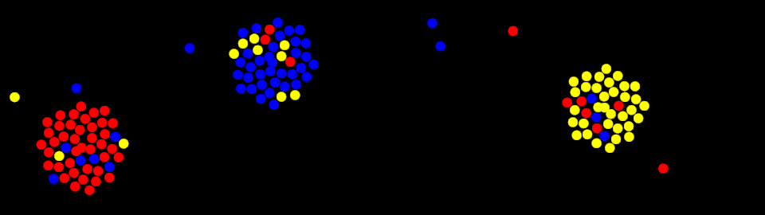

# EDILAB

This digital application is an experiment in the form of a cellular automaton. It simulates interactions between colored seeds and clusters of seeds (sunflowers). These interactions are governed by variable DEI parameters (diversity, equity, and inclusion). It’s like a mini-lab, as the range of possible experiments is vast, and surprises and discoveries are just a few clicks away.

## How can we make use of this experience?

Online version is hosted in my [EDILAB website](https://edilab.philippebrouard.fr). You can also build your own version, using the source code in the project_code folder. 

It's a single page web application. When the page is runing, select initial conditions (number of seeds, digital value pour DEI concepts) and press the start button. Then observe how the color groups evolve. After a while, the situation stabilizes. What is the result of the experiment? Which color, if any, has disappeared or nearly disappeared? What is the composition of the remaining groups? Repeat the experiment under the same conditions. Does it yield the same result? 

## Rule of the diversity

Groups can consist of several seeds of different colors within a sunflower, provided that diversity is accepted. The diversity of the group is calculated as the percentage of seeds that do not share the same color as the dominant color in the group. For example, a group of 10 seeds, consisting of 6 red seeds, 3 yellow seeds, and 1 blue seed, has a diversity of 40% ((3+1)/10).

## Rule of equity

Following a merger, when two groups combine into a single group, the larger one absorbs the smaller one. In an egalitarian process, the seeds from the smaller group are distributed evenly around the periphery of the larger group. But in the case of an unequal process, some of the seeds from the smaller group are treated differently if they are the same color as the dominant color of the resulting group: they are integrated toward the center instead of being added to the periphery. In the case of the reverse equality option, it is then the minority seeds that are integrated toward the center as a priority, to simulate equity process.

## Rule of inclusion

When an inclusive process is activated, seeds from the periphery of a group are periodically brought back to the center through circular permutations. This mechanism is similar to the way penguins live. To combat the cold, groups of penguins behave in this way: the temperature at the center is more bearable than that at the periphery. In the case of reverse inclusion, it is the seeds from the center that are sent to the periphery at regular intervals.

## Batch processing

This automatic mode is very convenient for anyone who wants to study EDILAB more intensively! The program can repeat the experiment as many times as desired under the same conditions. The end of an experiment is determined by a period of inactivity, a time during which nothing significant happens, and the groups no longer evolve as a whole. The second duration to specify is the time at which the experiment ends in any case. Detailed parameters are listed at the end of each experiment in the results summary table. The automatic system takes a screenshot of the current state before restarting the next experiment. This means you can truly let EDILAB run on its own and simply record the results of the entire set of experiments.

